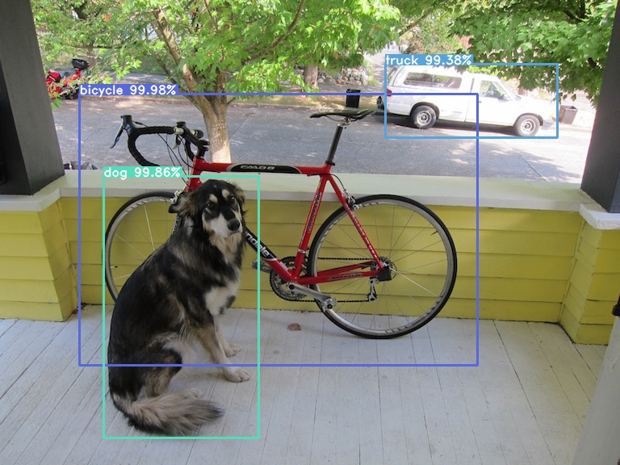

# TensorFlow2 Model Garden Project Example - YOLOv3 

# Image
<p align="center">
    
</p>

# Video

[](https://youtu.be/pa8GEZ6nBnk "TensorFlow Model Garden - YOLOv3")

# TFMG Components


| Folders      | Required | Description                                                                                                                     |
|-------------|----------|---------------------------------------------------------------------------------------------------------------------------------|
| **modeling** | yes      | Darknet and prediction models and the building blocks.                                                                          |
| **ops**     | yes      | Operations: bounding boxes and NMS functions.                                                                                    |
| **losses**      | yes      | Loss function.                                                                                                                |
| **dataloaders** | yes      | Decoders and parsers for data pipeline; load pre-train weights to model.                                                       |
| configs     | yes      | The  config  files for the task class to train and evaluate the model.                                                             |
| tasks       | yes      | Detection and training tests. Tasks for running the model. Tasks are essentially the main driver for training and evaluating the model.      |
| common      | yes      | Registry imports. The tasks and configs need to be registered before execution.                                                          |
| utils       | no       | Utility functions for external resources,  e.g. downloading weights, datasets from external sources, and the test cases for these functions. |
| demos       | no       | Files needed to create a Jupyter Notebook/Google Colab demo of the model. |


```
find . -size +20M | cat >> .gitignore
```

## Usage
### Installation

```
pip install -r requirements.txt
```

### Download Pretrain 

```
# yolov3
wget https://pjreddie.com/media/files/yolov3.weights -O data/yolov3.weights
python convert.py --weights ./data/yolov3.weights --output ./checkpoints/yolov3.tf
```

### Detection

```
# yolov3
python detect.py --image ./data/dog.jpg  
python detect.py --image ./data/street.jpg  
python detect.py --image ./data/eagle.jpg  
python detect.py --image ./data/giraffe.jpg 
python detect.py --image ./data/girl.png

# webcam
python detect_video.py --video 0

# video file
python detect_video.py --video_path ./data/times_square.mp4 --video True
python detect_video.py --video_path ./data/taryn_elliott.mp4 --video True

# video file with output
python detect_video.py --video path_to_file.mp4 --output ./output.avi
```

### Training

```
python train.py --
```

### Command Line Args Reference

```
# convert.py

# detect.py

# video_detect.py

# train.py


```

## Implementation 


### Darknet

